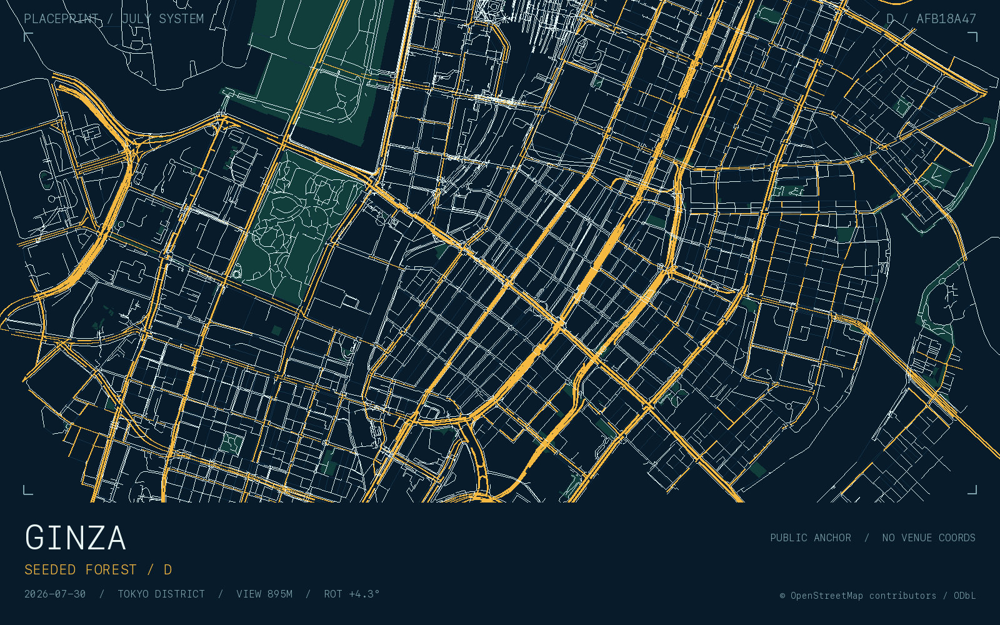
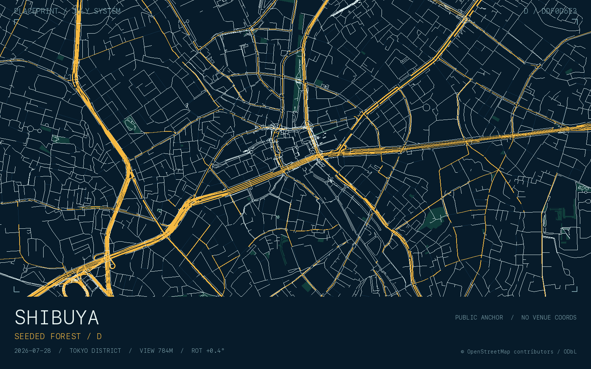

# log

## 2026-08-04

7:00から作業を開始すると、本当に1日が長く使える気がする.

昼頃には新宿御苑に向かい年間パスポートを新調した.
気さくなスタッフの人に手続きしてもらったが、どうやら色々とシステムが新しくなったとのこと.
これからは期限の切れた年間パスポートを持っていくと、そのまま更新出来るようになったらしい.
この頃の新宿御苑は本当に緑が綺麗で、そこまで熱くない気温も相まって非常に居心地が良かった.

午後は高田馬場あたりで勉強していた.特に理由はない.

夜は、渋谷あたりで引き続き作業諸々やっていた. これまた特に理由はない.

今日はいい1日だった.

## 2026-08-03

今日も朝からcafeで作業. 色々と捗った.

午後は研究室に顔を出した後、留学生の友人と久々にテニスをした.
自分でもびっくりするくらいに下手になっていたがとにかく楽しかった.
こんなにもテニスが走るスポーツだったとは、思ってもいなかった、というより完全に忘れていた。
最近は止まっているボールを正確に打つ競技しかしていなかったので、動いているものに面を合わせる感覚が鈍っていた.
約1時間だったが、少し感覚を取り戻した気がしている。
テニスもまた再開しようと思った1日であった.

## 2026-08-02

latexで `\varepsilon` の `var` は、variant（異体・別字形）の略ということを今更知った。
ついでに、`quad` は quadrant / quadratus（4・正方形） に由来する、組版の「四角い空き」の単位とのこと。

あと、quadが作る空き幅は 1 emで、1 emはその要素の現在の1 font-size.
活版印刷に由来して、従来は大文字Mの横幅を基準としていたことから"em"らしい(Mの発音が'emなので).

em-dashのemもM幅のdash, en-dashもN幅のdashだなと、色々納得がいった。

## 2026-08-01

今朝は、人を誘って朝からcoffee飲みながら作業をしていた。
やはり、誰かと一緒に作業する約束をするのは謎の責任感が働いて良い。
また自ずと集中できる。

昼は横浜の方に出かけてテニスラケットのrestringをしに行った。
非常に久々な張り替えだったので, 勝手を諸々忘れてしまっていた.
来週テニスするのが楽しみで仕方ない.

夜は渋谷辺りで勉強・研究などなどしていた.
お祭りがあったのか、浴衣を着ている人をちらほらと見かけた.
夏を感じる.

めちゃくちゃどうでもいいけど、7月の個人的log MVP賞をC氏の

> 2026/07/22
> I found a good way to stretch the back of my legs.

に捧げたいと思います。この1行、今見ても味がする。

今日は総じて良い位置にだった.
8月、良いスタートダッシュを切れたのではないかと思う.

## 2026-07-31

今日は、約半年ほど続いていた,とあるプロジェクトが節目を迎えた.
あまり詳細は書けない（書かない方が良い）けれども、非常に充実した毎日だった.
支えて頂いたチームの皆様には本当に感謝しています.
技術的にも、コミュニケーションを含むそれ以外の側面でも大きく成長できたと実感している.

ここでの経験を活かして、次のステップに進んでいきたいと思う.

Harder, Better, Faster, Stronger!

## 2026-07-30

今日は色々と切羽詰まったタスクが重なり、忙しない1日だった.
ただ、やる必要のある事が減ってきたので、そろそろやりたいものの詰んでしまっていたタスクに腰を据えて取り組めそう.

今日は銀座あたりに出てきていたが、あんまり散歩して回る余裕がなかったのは残念.

## 2026-07-29

友人と肉を食べた。
毎度のことながら無駄に次から次へと話が盛り上がる.
一つもtopicを落とすまいという気迫.
なんでそこ拾えるんだというツッコミ.

今日のまとめ:

> _We're Off: The Race to ¥10 Billion_

> _And See you at SpaceX(?)_

## 2026-07-28

昼間に認知機能を使いすぎたせいか、夕方はややエネルギー切れになってしまった。
認知機能の”体力”をもっとつけたい. *keep thinking...()
夜は気分転換に渋谷に出てきて、論文を読んだり幾つか実装をしたりしていた.

最近、巷ではsetlogが流行っているらしい.
先日cafeで若い集団が「これ入れればいいの？」「動画なんだ、ヘぇ〜」などと話しているのを小耳に挟んで、BeRealの話でもしているのかなと思っていた.
しかし、日経新聞の[この記事](https://www.nikkei.com/article/DGXZQOUC151VN0V10C26A6000000/)がfeedに流れてきて、あぁあれはsetlogの話をしていたのか、と勝手に点と点が繋がった.
setlogは2秒間の動画を定期的にアップして、その瞬間を共有するsnsサービスらしい。
instagramよりもdeepで、BeRealと違って時間制限に追われる焦燥感もない、という両者にない絶妙な立ち位置が支持されているよう.

setlogが流行るなら、git logももっと盛り上げて行きたい.
というわけではないが、このgit logにもう少し表現の幅を広げる方法はないかな、とは思った.
所詮markdownなので画像貼るくらいだろうか.
ただ画像を貼るのもなんだかなと思っていたので、試しにその日印象的だった場所の地図を貼るのはどうかと考えてみた.

publicなrepositoryなので、privacy的な側面でどれくらいの粒度にするのか等考える必要のある部分はあると思う.
けれど、その日思ったことと、その日印象的だった場所がlogとして記録されるのは結構面白いのでは.
良い塩梅を模索中.

## 2026-07-27

昼間はずっと般教の期末レポートを書いていた。

夕方は麻布台ヒルズ周辺を訪れていた.
以前来た時はまだショップがfullにopenしていなかったが、今度は新しい飲食店、ブティックいずれも多く開店していた.
中庭は間接照明を中心に上品に照らされていて、本当に雰囲気が良い.
Thomas Heatherwick氏による曲線美際立つ建築群は、何度見ても飽きない.
森ビルがデザインする都市空間はどのエリアにおいても, それぞれ特色があって楽しい.

作業をしつつも、過ごしやすい気温のなか夜にかけてゆったりとした時間を過ごした。
タスクはまだまだ山積みだけれども.

## 2026-07-26

昨夜は非常に寝付きが悪かった.

シミュレーション工学課題done.
量子系の固有状態を求める行列計算は（手計算可能なのように出来ているので）やっていて面白い.

東京駅周辺を訪れると、tokyo torchの建設が結構進んでいた.
日本一高いビル更新という事で、竣工を非常に楽しみにしている.

高層ビルといえば、元日本一のあべのハルカスが思い出される.
高3の時、受験勉強の合間にあべのハルカスの中層階あたりで友人との雑談かたわら取った写真が、いまだに自分が今まで撮った写真の中で最も良い風景写真となっている.
別に写真マニアでもなければ、カメラにこだわりもない(万年iPhone camera)けれど、あの時撮った写真より良いものが撮れないはとても不思議.

その日あったことを記録として残すのがlogであるのに昔話ばかりしてしまっている.
日々の記録を残していくことで回顧録となるのに, 日々"回顧録"をしていては如何なものか.

昨日、隅田川花火大会があったそう.
自分は行っていないけれど、この[日経新聞の記事](https://www.nikkei.com/article/DGXZQOUD2528K0V20C26A7000000/)に添付されていた写真を見て、凄く綺麗だなと思った.
基本的に新聞はshockingなnewsばかり並ぶけれど、そんな中で、こういったなんてことはない記事があるととても良い.

花火といえば、nujabesのafter hanabiはやっぱり何回聴いても良い.
ただ、youtubeのコメント欄を見てみると、happy new yearの言及で溢れていた.
after hanabi自体は、日本の夏の花火とそのノスタルジックな雰囲気をテーマにしていると思うけれど、確かにUSだとhappy new year fireworksということになるのか.
また一つ面白い文化の違いを感じた.

## 2026-07-25

同時期に複数の集団に参加していると、事が上手く運んでいる集団とそうで無い集団の差異が、そこはかとなく感じられる。
双方向のrespectと、一定水準の倫理観は欠かせないと思う。コミュニケーションが円滑で無いだけで、チーム内のmoraleが徐々に崩れていってしまう.

延期していたstarhip's 13th flight testが無事今日行われた.
boosterには、新型の Super Heavy V3が投入された。launch, starlink deploy は期待通りの流れだった。
boosterはlanding burnの時に、いくつか点火しなかったものの、starhipに関しては上手くsoft splash downして、しかも初めて着水後に爆発しなかった。
爆発していない機体は回収時に多くのデータを回収できるので、今回のflight testは非常にfeedbackが豊富なテストになったそう.
記念という訳ではないが、spacex.com で t-shirt を3枚買った. 届くのが待ち遠しい.
Go Starship, Go SpaceX!! (and Go SPCX)

今日の夜はここ最近の中では比較的涼しく過ごしやすかった。
shibuya sakura stage は、桜丘町という地名からきている事をmapを見ている時に気づいた。
夜風を浴びながらの渋谷散策は非常に気持ちが良かった.

## 2026-07-24

作業はしていたものの、やる必要のあるタスクが片付かない.

一度聞いたことのあるpodcastを何回も繰り返し聞いている. 情報のインプットが無い.

夜はgolf rangeにいった.
効果的でないのは理解しているものの、無性にボールを飛ばしたい衝動に駆られた。

明日は良い1日にする.

## 2026-07-23

sleep score: 88. improved.

今日は非常に生産的な１日だった。積まれたタスクよりも消化したタスクが遥かに多かった。
やはり, sleep scoreは裏切らない。

東横線で、終点渋谷の列車が副都心線のホームでそのまま折り返すパターンがたまにあるけれど、これかなりのトラップだと思う。
副都心線乗るつもりで乗車し、「武蔵小杉行」の表示見て",,?"となっている人を毎回見かける.

明日は早朝から作業を開始する.

## 2026-07-22

今日はマルチタスク気味で、散漫だった。
人間の意識は実質シングルコアなので、結局のところ頻繁にcontext switch しているだけで、pseudo-parallelにしかならない。
switching costを意識して一つの事にまとまった時間を使わないと、大きな進捗は出にくいな、と改めて反省した。

帰宅後、無駄にダンベルトレーニングが捗った。

## 2026-07-21

sleep scoreは低かったが、アラームより早く目が覚めた。珍しく目覚めが良い。

予定等で、参加者を書くときに `<task> w/ <name>`とするのをよく見かけるが、なぜ w. ではなくて w/ なのか疑問に思っていた。

GPT曰く、速記における慣用的な書き方らしい。

- with -> w/
- without -> w/o
- between -> b/w
- not applicable -> n/a
- care of -> c/o

なるほど, 確かに. N/Aに関しては、見慣れていたせいか気にしていなかったものの、これも速記由来の表現だったのかと謎の納得感を覚えた.

[Vibey Kpop UKG & House Mix (06:01)](https://www.youtube.com/watch?v=ZzSSha68kIE&t=241s)
この, nujabesのfeatherにtransitionする部分が何回聴いても飽きない。凄く聴き心地が良い.

software engineering(授業)の最終プレゼン無事終わった. 良いチームだった.

昨日から LINKIN PARK の "Breaking the Habit" がずっと脳内再生されている. 自ずとやる気が湧いてくる.

友人がUSに飛びたった.
have a nice flight :)

## 2026-07-20

昼頃、大阪から東京に戻ってきた.

夕方までは諸々の作業時間.

夜は、友人の送別会を行った。

いい日だった。凄く良い１日だった。

応援しているし、言われなくても頑張ると思うし、また、自分も同じように頑張りたいと一層強く感じた.

## 2026-07-19

sleep score: 81. ここのところずっと微妙な値が続いてる。

今日のcaffeine:

- 10:45 120mL 48mg
- 13:44 starbacks grande 216mg

計 264mg

今日知った表現:

- rasterization: convert (an image) into pixels. ドット絵にする、的な. computer graphics 用語.

[Proof of Fermat Last Theorem FROM SCRATCH](https://www.youtube.com/watch?v=9f-hGSh8lF0) というタイトルの動画をたまたま見つけた。
8h55m no-editの解説動画. 半端じゃない。

hardforkの先週の回を聞いていて、
“LOL, I found out I can access the [network storage], so funny.”
という引用に対して、

> 'If you say LOL in a message, you should not add so funny.'
> 'Yes. Omit needless words.'

というやりとりをしていて面白かった.
草にwを生やすな、に近いinternet slangが英語圏にもあるのかな、と思った。

## 2026-07-18

sleep score: 73. no comment

今日のcaffeine:

- 10:45 120mL 48mg
- 12:45 120mL 48mg
- 14:30 starbacks grande 216mg

計 312mg

grande, ventiは、イタリア語由来ということを今更ながら知った。
grande: 大きい, venti: 20 (USでホットが20 fl. oz.だったことから)

森ビルが虎ノ門ヒルズ周辺で大規模再開発を計画しているらしい。
以前から、ステーションタワーで7Fまで登る長いエスカレーター脇の窓から、古いナンバー付きの森ビル群が見えていたが、ちょうどそこをリノベーションして、虎ノ門ヒルズエリアを拡張するとのこと。
個人的に虎ノ門ヒルズ周辺はお気に入りのスポットで、よく出かける場所でもあるので楽しみ。
つい去年、ステーションタワーが竣工して、長らく続いていた虎ノ門プロジェクトがひと段落ついたと思っていたところだったけど、森ビルによる都市開発は止まらない。

大阪では、クマゼミがただひたすらに大合唱している。
天王寺周辺を訪れると、なんだかやたらと懐かしい気持ちが沸いてしまう。

今日は、前々から気になっていた wish + bubble teaを使ったterminal appの開発をしていた。Goも身につけていきたい。

## 2026-07-17

sleep score: 83. durationを改善したい.

今日のcaffeine:

- 10:00 tully's 183mg
- 15:00 tully's 183mg

計 341mg

`;;d`で、yyyy-MM-DD が自動で挿入されるsnippetをraycastで登録して実際に活用しているんだけど、この便利さがなかなか伝わらない.
あんまりユースケースが思いつかないかもしれないが、それこそlogの日付やコミットメッセージに日付を入れたいときなど、結構使えるシーンは多い。
同じように、`;;t` で HH:MM が自動挿入されるsnippetも結構気に入っている.

engulf: <不快感などが><人>を襲う.
hacker newsのコメントでたまたま見かけて初見だった単語。
類義語: inundate, flood, swamp

最近、PRをreviewする機会が増えた。
reviewコメントをするには、当然その周辺ロジックについて理解しておかないと指摘・質問できないので、じっくりとコードを読む時間が増えて逆に勉強になる。
coding agentに実装させるAI時代の開発においては、逆にjuniorこそreviewする機会が沢山必要なのかもしれない。

夕方、所用で大阪に来た。
なんだか知らないが、大阪にいると内省が増える。

## 2026-07-16

sleep score: 73.
今日はdurationではなく, interruptionsが足を引っ張った。

今日のcaffeine:

- 08:50 tully's 183mg
- 15:00 starbucks tall (350mL) 158mg

計 341mg

銀座のitoyaに寄った際、ふとショーケースを覗くと、10年前にこの場所で祖父に買ってもらったのと全く同じromeoのボールペンが, 当時と同じように置いてあった。

vnlが熱い。日本連勝が続いている。undefeated! 明日のベルギー戦も頑張って欲しい!

日本時間、明日朝に、[starship's 13th flight test](https://www.spacex.com/launches/starship-flight-13) が控えている。
SpaceX IPO 後初のstarship flight testで、プレッシャーが相当かかるとは思うが、期待してます.

My friend mentioned me by name in [his public diary](https://github.com/k2co3-0803-n/log/commit/27436698e0b66ae0aefcddf9b610c7b46850e684).
So, I suppose the pact is public now. I have to write, and of course, I have to keep writing.
See you here in fifty or sixty years.

## 2026-07-15

sleep score 79. 微妙なスコアが続いている。

今日のcaffeine:

- 09:30 tully's 183mg
- 12:45 starbucks tall (350mL) 158mg

計 341mg

夜、golf rangeに行った。
インパクト時、窮屈なスイングになってしまっているなと長いこと自覚があったのだけれど、take backからインパクトにかけて、腕の進行方向とは反対に、頭を右に引く・残すイメージがあると良いかも、とfeedbackをもらった。
もちろん無理やり頭を右の方へスライドさせるわけではないが、このイメージを持つことで、体の前の空間が広がって、右腕が変に曲がらずにインパクトに入れるようになった気がする。
この部分は反復して、もっと改善していきたい。

たまたまニュースで見たが、USの下院でサマータイムを通年化する法案が可決したらしい。
今、西海岸との時差が17時間なのか、16時間なのか時々ややこしくなるので、通年化されると明瞭で良いなと思う.
上院での判決に注目したい。
2022年のときも同じ議論が挙げられて、当時は上院で可決されたものの、下院で廃案となったらしい。

inputが少なめの１日だった。明日は研究に時間を多く割きたい。

## 2026-07-14

sleep score: 75. 今日はdurationが足を引っ張った。

今日のcaffeine:

- 09:20 tully's 183mg
- 14:30 tully's 183mg

計 366mg. 毎日logにcaffeine量を記載するようになってから、少しずつ減らそうという力学が自然と働くようになった気がしている。

"semiquincentennial"という単語があるらしい。
意味は、250周年。US 250thの文脈で最近ちらほら見かける。

- semi: half
- quin: five (quintuplet)
- centennial: hundredth anniversary

ということらしい。

全角の「！」はスペースが大きすぎて, 視覚的に違和感があって使いづらい！！
ので半角"!"を重ねて"!!"を使うことが多いのだけれど, あまり共感されない!?
「レタースペーシング タイポグラフィにおける文字間調整の考え方」を読みたいと思って積んでいたけれど、すっかり忘れていた。

インドアの空調付きテニスコートを探していたけど、あまり見つからない。
便利な場所はやはり競争率が高く、早くから予約が埋まっている,,

早くもlogレポジトリーの更新が途絶えている件がちらほら増えて来ている.
pushしていないだけだと勝手に願っています()

朝起きたと思ったら、気が付けば夜になり、その日のlogをつけている.
時の流れがなんだおかしい...

## 2026-07-13

sleep score: 72. まずまず、と言ったところ。
自覚はないが、interruptionsが結構あった模様。

今日のcaffeine:

- 12:15 costa coffee 多分120mg
- 13:30 tully's 183mg
- 15:15 starbucks 多分120mg

計 423mg

今日はあっという間に１日が終わっていた。
ひたすらに喋っていた気がする。

browserの操作方法は普通, 学ばないけど、一番生産性に寄与するproductivity hackだと個人的に思う。

wimbledon finalが熱かった。
zverevが第一ゲームを取ったとき、このまま勝てるんじゃないかと思った。
ただ、sinnerが徐々にギアを上げてきて、break chanceを2回ものにし、優勝。
両者、試合後のコメントも含めて、ただただ素晴らしかった。

何をするにも環境が大事、という話が定期的に話題に上がる。
今週も頑張ろう。

## 2026-07-12

sleep score: 61. what the..
確実に昨日の夜のcaffeine摂取が悪影響を及ぼしている。

他の人のlogへのコメントをする方法として、github issueが案外使えるかもしれない。

今日のcaffeine:

- 09:00 tully's 183mg
- 11:30 starbucks 多分 120mg
- 14:00 starbucks 多分 120mg
- 15:00 drip coffee 多分 80mg

計 500mg

最近のローカルLLMはどんなものなのかと思い、LM Studio経由でGemma 4 E4Bをダウンロードして、使ってみた。
思っていた以上に性能が良い、というか、簡単な質問だとレスポンス速度もクラウドベースのサービスとほぼ同等の推論速度だった。
意味調べや英語のレビューみたいな言語関係のタスクであれば全く問題なく日常使いできると思う。

LM Studioのインストールから、Gemma 4 E4Bを使い始められる状態にするまでのセットアップは、codexによって, end-to-endで完全に介入なしで完結した。
(GUIでボタンを押す必要がある部分も、勝手にcomputer-useでやっておいてくれる)
what a time to be alive.

所用で井の頭線に乗った。
歌詞の「井の頭線に揺られて〜、偉くなった気が〜、しなくも〜無い夕暮れ時〜」が毎回思い出されるw.

先週のweekly reviewをするために、codexを使って先週あった出来事・記録の棚卸しをさせると、
What could be adjusted? として、

- 15:30以降のカフェインを避ける方針を守れなかった。
- 環境設定やツール調査に関心が移りやすく、主研究の実験実行が後ろに残った。

がなどが指摘された。正論すぎて耳が痛いが、反省して今週から改善したいと思います。

夜は小雨がちらほらと降り、かなりの湿度だった。外の空気からは夏の香りがした。

## 2026-07-11

本日のsleep scoreは 98 だった. 非常に調子が良い。

今日のcaffeine

- 14:30 tully's 183.3mg
- 16:00 猿田彦コーヒー 多分120mg くらい
- 19:30 紙コップ1杯 約80mg

計 380 mg

動作に問題はないが、このところmacのmemory pressureがずっと80%以上で気になっていたので、CodeXに調べさせてみた。
結果としてしては、dasd(mac os system)が41 GB近く使っていたらしい（勿論swapしている）.
chromeが18 GB使っているのは、仕方ない気もするが、dasd の41 GBは使いすぎな気がする。
17日間ほど起動し続けていたことによって色々と問題が起こっていそう。
そもそもdasdが何かよく分かっていなかったが、Duet Activity Schecular Daemonの略で、macOSのバックグラウンド・タスクスケジューラとのこと。
どうやらmacOS 27のbetaを使っていることが原因のよう。
software updateを確認するとbeta ver. 3が来ていたので、再起動のついでにアップデートすることにした。
tetheringで17 GBのdownloadをするのは少々気が引ける。

全然関係ないけれど、wi-fi tetheringは、口語で、mobile / personal hotspot と呼ぶ方が一般的らしい。
e.g., "I don't really wanna download a 17 GB update over my mobile hotspot."

ballpark: くだけて「概算」の意味らしい。初耳。be in the ballpark で、<見積もりなどが>ほぼ正しい、の意。

髪を切りに原宿へ出かけた。
JR原宿駅の改修工事はもう直ぐ終わりそうだった。完成が楽しみ。
原宿は広い空と賑やかな人通りで、歩いているだけで面白い。

shibuya stream <-> shibuya sakura-stage の歩道橋が完成していた。渋谷の再開発も着々と進んでおり、完成が待ち遠しい。

public "log" repositoryの布教。
次世代のsnsは、threadでもmastodonでもなくgit remote なのかもしれない。

とりあえず、logが三日以上続いているので、三日坊主は回避した。
続けることが優先事項であることを考えると、明らかに文量が多いなと薄々気がついている今日此の頃。

## 2026-07-10

今日のcaffeine

- 09:30 tully's 47mg / 100mL * 390mL = 183.3mg
- 14:30 tully's 47mg / 100mL * 390mL = 183.3mg

計 387 mg

codex appがchat gpt appにintegrateされていた。
基本設計として、何か作業をend to endでさせる体験を目指している雰囲気を感じる。
従来のchatは、フローなものとして扱い、これからはtaskをストックする対象と考える方向性なのかもしれない。
アップデート後、旧chat gptは、"ChatGPT Classsic"の名でapplicationsフォルダーに居座っていた。
gpt 5.6 solがどれくらいの性能のものなのか、まだあまり試せてはいないが、open aiもanthropicにならって、モデルに名称を付けたくなった事だけは分かった。

夜はgolf rangeにいった。take backは割とイメージ通りになってきたものの、インパクト時のfaceの向きとfollow throughの伸びには課題があると自覚している。
一方、いつ見てもMcIlroyのスイングは美しすぎる。
全く関係無いが、"McIlroy"は大文字のIと小文字のlが連なっていて非常にややこしいと思っていたけれど、これは元々 Mcが接頭語(~の息子)で、続く名前(Ilroy)をIrelandの慣習的に大文字で表記することから来ているらしい。
McDonald'sが、Donaldの息子、と同じような感じで、Ilroyの息子、というわけらしい。なるほど。

毎週金曜日は、_Star City_ の最新話を楽しみにしているのだけれど、周囲で誰も見ていない。
びっくりするくらいApple TVのコンテンツを見ている人がいない。
reddit の r/StarCityTV で感想を見るくらいしか出来ない。for all mankind, star cityはマジで熱いと個人的に思っている。

読みたい本が永遠にqueueに積まれていく。
熱い、夏の始まりを感じる１日だった。

## 2026-07-09

たまたまが重なると、かなり想定外の状況に陥ってしまうことを改めて、実感した。

今日のcaffeine

- 09:30 tully's 47mg / 100mL * 390mL = 183.3mg
- 14:30 コップ一杯 約200mL, 約80mg
- 16:30 コップ一杯 約200mL, 約80mg

計 340mg

そんなに重くはないが、積んでいたタスクを消化。

日本語の業務slackメッセージはかなり難しいと思う。兎にも角にも `:bow:`

Zverevの勢いが止まらない。roland-garrosを経て、wimbledonで覚醒している。準決勝も凄く楽しみ。

美容室の予約を入れた。
いつも、大体1ヶ月おきに美容室に行くが、予約を入れるたびに、もうあれから一月が経ったのかと、無駄に焦りを感じる。

今日は、作業量は多かったものの、inputの少ない１日だった。明日は早めに仕事を切り上げて、学習に時間を割きたい。

ただひたすらに、円が安い。

## 2026-07-08

なんだか知らないが、最近周りで簡単な日記を git で管理するのが流行っている。
続くかどうかはさて置いて、便乗してみる。

repository layerを実装している中で、改めて DB の index について理解を深めたいと思った。
B-tree の実装の部分から、改めて、時間をとって勉強したい。

fable 5 の subscription での利用期間が延びたのは良いものの、如何せんusageの消費量が多くて直ぐ5hr limitが来てしまう。
使い分け・使い所が難しいが、工夫したい。

風通しが悪く、終始煙たかったものの、テラス（ベランダ）で食べた焼肉は美味しかった。
cappccino は、基本的に espresso + steamed milk + milk form で構成されている。
espresso 1 shot は約30mLで、そこには約63mgのcaffeineが含まれているらしい。
なんとなくdripじゃなければ、夜にcoffee飲んでも良いかと思っていたが, 案外caffeine入ってるね。

句読点とカンマ、ピリオドが混ざっているのはあまり気にしていない。
fifa world cup, wimbledon, vnl どれも面白すぎて目が離せない。
